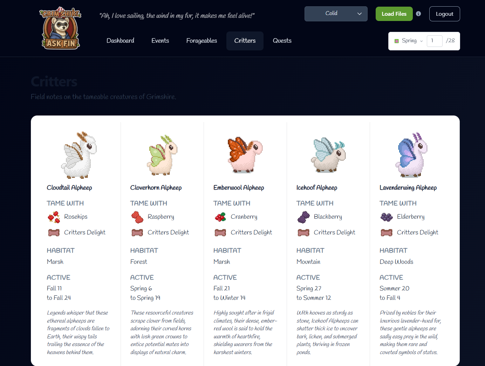

## Supabase Access Note

**Login with alex.bee.obie@gmail.com via email/password — do NOT use the GitHub-connected login button**, or you will not have access to the project.

Dashboard: https://supabase.com/dashboard/project/tsfvaiepnmnlijamkeua

## Core Feature — Save File Pipeline (Status & To-Do)

The central feature of AskFin is: user uploads a `.grimshire` save file → app reads their in-game progress → UI shows personalised data (discovered critters, fish, recipes, etc.).

### What is working
- `server/helpers/parseSaveFile.js` — XOR decryptor + regex field extraction is live and confirmed working.
  Verified output from `ExampleSave.grimshire`:
  ```
  playerName: "Felix", farmName: "Farmy Mc. FarmFace", saveFileVersion: 4,
  exp: 23300, playerSpeciesId: 1373, difficulty: 3,
  totalPlayTimeSeconds: 72411, playerPronouns: 1
  ```
- `POST /api/save/parse` endpoint accepts a base64-encoded file, parses it, and upserts into the `characters` table.
- `LoadSaveFile.tsx` sends the file to the server and shows a success/error message.
- Supabase `characters` table schema updated (see `server/sql/characters_schema.sql`).

### ID mappings — status

The save file stores progress as arrays of integer IDs, e.g.:
- `fishDiscovered: [228, 483, 671, ...]`
- `crittersDiscovered: [...]`
- `unlockedCraftingRecipes: [1453, 1454, 427, ...]`
- `itemsDiscovered: [...]`

**RESOLVED for items/fish/recipes:** ID → name mappings have been extracted and live at `server/helpers/game_id_maps.json`. 701 item names mapped (fish are InventoryItems so they're included). The extraction script is `server/helpers/extractGameData.py` — a Python/UnityPy script that reads the game's Unity Addressables localization bundles from `Grimshire_Data/StreamingAssets/aa/StandaloneWindows64/`.

**Still needed — critter species names:** `crittersDiscovered` IDs map to `CritterData` ScriptableObjects whose `displayName` is NOT in the localization tables. The `CritterNames` table in the localization bundles contains tamed critter pet names (Apollo, Mochi, etc.), not species names. Options:
- A) Accept that we can't show critter species names for now and skip them in the UI.
- B) Manually build a small static JSON of critter ID → species name by loading the game and checking which critters are discoverable in-game.

### How the extraction works (for reference)
- The game uses Unity Addressables + Unity Localization. Item names are in `InventoryItems Shared Data` (key: `{id}_name`) and `InventoryItems_en` (numeric key → localized string). The Python script joins these two bundles to produce `{game_id: name}`.
- The decompiled C# is in `grimshire-decompiled/Assembly-CSharp/` — useful for understanding save file structure. Key files: `GameData.cs`, `SaveObject.cs`, `ResourceManager.cs`.
- **Do NOT use dnSpy advice from old notes** — that was superseded. The extraction is done via the Python script above.

## Authentication System Implementation

**Status**: AuthContext.tsx created; database schema ready (profiles, characters tables). Pending: client-side auth UI and routing still needs debugging.

**Next Steps:**

All of the below are items for us to test later on 

1. **Quest page: "Available now" vs "Active now" badge, and item name resolution**

   **Quest status badges:** The quests page currently shows a green "Active now" badge for any quest whose availability window overlaps the current in-game date. But in Grimshire, a quest doesn't become active until the player speaks to the NPC to accept it — the window just means the NPC *will* offer it during that period. We should:
   - Change "Active now" to **"Available now"** (pale orange / amber badge) as the default for quests whose window is open, since we can't confirm the player has accepted them.
   - Reserve a green "Active" or "In progress" badge for confirmed in-progress quests — but this requires knowing which quests the character has already accepted, which the `.grimshire` save file may store. Check `grimshire-decompiled/Assembly-CSharp/SaveObject.cs` for a field like `activeQuests`, `acceptedQuests`, `questsInProgress`, or similar array of quest IDs. If such a field exists, add it to `parseSaveFile.js` extraction and use it to drive the badge color.
   - **Open question for game devs:** Do the displayed date ranges (e.g. Spring 1–Spring 28) represent (a) the window the NPC will *offer* the quest, (b) the deadline to *turn it in* after accepting, or (c) both? If (a) and (b) are different windows, we need two date ranges per quest in `quests.json`. For example: can a player accept the quest on Spring 27 and still turn it in by Spring 28, or must they accept it before some earlier cutoff?

   **Pending: quest item name resolution:** `server/helpers/quests.json` contains requirements and reward_items as `"Unknown item (path_id=XXXX)"` because item name lookup is not yet working. The data pipeline (`parseAssetStudioDumps.py`) correctly extracts the path IDs from UABE dumps, and `diagRawBytes.py` confirmed that raw byte parsing at offset 28 (m_Name) and the Id field immediately after gives the correct game ID (e.g. path_id=25174 → game_id=34 → "Carrot", path_id=25188 → game_id=294 → "Hawthorn Berry"). The blocker is that the current UnityPy version's `EndianBinaryReader_Streamable` reader object does not expose a `byte_size` attribute — need to find the correct attribute name (try `dir(obj.reader)` or `dir(obj)` on an item MonoBehaviour to find size/length) and update the path-ID map building section of the parse script accordingly.

2. **Optimize layout for Quests page to have maximum utility at a glance** - can you divvy the Quests page up so it has a top row with two columns (Root Cellar and Donation) and then one column under those called Side Quests? we want to add a toggle to this page called "Show Town Quests (Events)" that when clicked, splits our one column of Side Quests into two columns, Side Quests and Town Quests, with the same format as we have right now for the "card" that holds data about each quest (though they will have a smaller width due to the columns, otherwise identical is the goal). to be clear, we want to render only quests where the Type matches the column title into each column described above. Note: order donation quets by the number of specimens required (see titles in format "Donate 30 Species", we can parse that string to create our own sorting order if there isn't an easier way, but we will likely need to convert that substring of "30" to an int to actually sort by it across that subset of quests).

3. **Fix spoiler settings application to Quests page** - If a user has set their spoiler gate toggle to FALSE for quests, we still want them to be able to see stats about their previously completed quests in this section, even if their spoiler protection is set to "on" for upcoming/undiscovered quests on this character. we will need to separate the existing toggle into two separate toggles in the user settings - right now we have upcoming/undiscovered quests, but we need one for upcoming/undiscovered Villager quests, and one for upcoming/undiscovered Community quests/events.

4. **For us to test later: Fix logout functionality** — Executing a logout still has different issues, I can describe them when we get to this. For example, the login page has "visit as guest" button or whatever it's called encroaching visually on the regular login space, something with the css is off there. Then when I do log in as guest, we need to handle a lot of weird bugs/blank space that should have stubbed data with a warning that this is just a sample of what you'd get, with a notice to hit Login button in the top right to see your own data.

5. **Forageables tab needs to be populated with real data** - we want to populate the Forageables tab with the correct info based on the selected date from the datepicker (which, as a subtask, we should make sure auto-populates based on character data from the most recent upload file for a given character when the user clicks a character in the selector in the header). The forageables shown should be only what is available right now in-game, based on the date it is in the datepicker, plus a little brief box with the next three forageable items that will become available at the bottom of the page, listing their image, name, and what date they will start being available.

6. **Ensure settings make it to DB** -  can you confirm that dark mode is actually saving as a setting in the supabase db when we hit save on the toggle? same question for all the other toggles, are those user settings being saved to the db? we should shift that from being at the character level (unique to the character selected in the header dropdown) to instead being tied to the user who is logged in at this time. that data should be stored against the userid somewhere in supabase.

7. **Darkmode ineffective on Critters Page** - we need to fix up the critters page to adequately render the data for visibility while removing all the white background. see image below.  - note that the title Critters and desription "Field notes..." are almost illegible in how dark they are on a dark background, and then there's a ton of white backgrounds (and pale yellow highlight backgrounds further down the page actually not in the image) but we wnat the highlight function to still work but be maybe a dark teal on top of a background that would be by default dark blue-grey, like the rest of the background on the image page.

8. **FAQ tab** - the goal here is to have a key known issues and known confusing elements tab, there is a lot on the Grimshire official discord channel and GrimshireGame reddit that are hard to sift through to find out what is confirmed (or not) as known bugs/known upcoming features in the next release. It would be nice to have an AcuteOwl-certified FAQ page, with a link to their discord at the top, and a link to the GrimshireGame subreddit at the top. sample items for the FAQ: 1) No,  you can't trigger cutscenes related to romancing anyone yet, but you *can* earn hearts or relationship points, and practice gifting liked items to villagers. It's also worth discovering which items are liked/disliked for both romanceable and non-romanceable characters for future gameplay and to receive gifts from villagers who have a good friendship with you. A blue rose by the name of the character in the ESC menu indicates that they are/will be romanceable. 2) Your baby animals do not take up space in the pen, not until they become adults. If your pen is overcrowded, animals can get sick. (this answer needs further detail on the role of medicinal feed, contagion between animal species, and timing of the roll for will-an-animal-get-sick for optimizing butchering times)