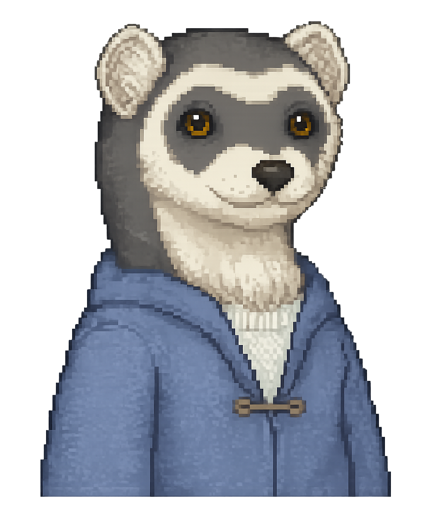

# AskFin

Welcome to **AskFin** — your cozy companion app for exploring, organizing, and interacting with your Grimshire game world data.

AskFin is designed to help players upload their save/game files, browse critters, forageables, world data, and eventually uncover deeper insights about their adventures. ✨

---

## Goals of the Project

AskFin aims to:

* Provide a friendly interface for viewing game data
* Help players organize and understand collected creatures/items
* Allow save-file importing and profile-based data loading
* Create a playful and visually cozy experience
* Support future expansion for analytics, maps, guides, and discoveries

---

# 🔧 Tech Stack

* Frontend: React / Vite / TypeScript
* Backend: Node.js / Express
* Database: PostgreSQL/SupaBase
* Auth: Username/Password at this time, chose to skip Google OAuth for now

---

# Getting Started

## 1. Clone the Repository

```bash
git clone https://github.com/sedulous-mortal/AskFin.git 
cd AskFin
```

---

# Running the Frontend

Open a terminal and run:

```bash
cd client
npm install
npm run dev
```

This will start the frontend development server.

---

# Running the Backend

Open a second terminal and run:

```bash
cd server
npm install
npm run start
```

This will start the backend server.

---

# 💾 Uploading Your Game File
> Coming soon!

To load your game data into AskFin:

1. Open the localhost in the browser (ideally Chrome)
2. Create or log into your profile
3. Click the **Load Files** button in the header
4. Upload your `.grimshire` save file(s), typically found at `C:\Program Files (x86)\Steam\steamapps\common\Grimshire\Grimshire_Data`
5. Wait for AskFin to process and import your data ✨

Once uploaded, your critters, items, and other game information should appear throughout the app.

---

# 📁 Project Structure

```text
AskFin/
├── client/     # Frontend application
├── server/     # Backend API/server
└── README.md
```

---

# 🌟 Planned Features

* Critter checklisting capability to track which you have on your farm
* Forageable tracking and tips (maps of where to expect to find all cherry trees, for example)
* Seasonal activity timelines (what to stock for upcoming villager birthdays, etc, and when to stock them so they don't go bad before turn-in)
* Search + filtering (this will be for the "Ask Fin" capability to quickly get correct answers since Googling leads to false AI results)
* Analytics/dashboard views of stats *across* your characters, not just a single character at a time

---

# ✅ Completed Features

* Ability to view the app without logging in, by hitting "enter as guest" to use the tools as a reference but not share unique character data from your gameplay
* User profiles (hosted in SupaBase) with the ability to create a new profile (sign up)
* Save-file parsing (this will be a heavy lift to fully complete, but a basic version of it is fully operational, and impacts what the Dashboard shows for each character you select from the dropdown -- the goal is to have it impact what you see on every tab)
* Ability for users to reset their password with a magic link from SupaBase to their email
* "Days remaining" calculations for finding fish/seasonal forage for Adeline's research (this is built but not being shown on the front end at this time, as it will integrate with Forageables tab which is not complete yet)
* Critter encyclopedia on Critters tab in navigation header
* When you interact with the datepicker in the header on the Critters tab, the associated possible critters that could be active in the game get an instant pale-yellow background highlight, so you know what to skim for easily

---

# Development Notes

## Environment Variables

Both `.env` files are listed in `.gitignore` and will **not** be present after cloning — you must create them manually. Neither should ever be committed to version control. If you need a key to get started, reach out to alisonnicolestuart@gmail.com.

### Which key does what?

AskFin uses two separate Supabase keys, each with a different scope:

- **Anon/publishable key (`VITE_SUPABASE_KEY`)** — used by the browser-side client in `client/src/lib/supabase.ts`. This key handles all auth flows the user touches directly: signing in, session management, sign out, and password reset. It is safe to ship to the browser because Supabase's Row-Level Security policies restrict what it can access.
- **Service-role key (`SUPABASE_SERVICE_ROLE_KEY`)** — used by the Express server only. It bypasses RLS and is used for privileged operations like creating users, reading game data tables, and rate-limit tracking. This key must never be exposed to the browser or committed to version control.

### File locations and contents

Create the following two files by hand after cloning:

**`AskFin/server/.env`**
```
SUPABASE_URL=https://tsfvaiepnmnlijamkeua.supabase.co
SUPABASE_SERVICE_ROLE_KEY=your-service-role-key
FRONTEND_URL=http://localhost:5173
PORT=4000
EMAIL_RATE_LIMIT_MAX=2
EMAIL_RATE_LIMIT_WINDOW=3600
```

**`AskFin/client/.env.local`**
```
VITE_SUPABASE_URL=https://tsfvaiepnmnlijamkeua.supabase.co
VITE_SUPABASE_KEY=your-anon-publishable-key
VITE_API_URL=http://localhost:4000
```

## Database (Supabase)

The app uses a hosted PostgreSQL instance via Supabase. Key tables:

| Table | Purpose |
|---|---|
| `profiles` | One row per registered user |
| `characters` | In-game characters linked to a profile |
| `critters` | Critter types and subtypes with sprites |
| `critter_foods` | Junction table: critter ↔ edible |
| `edibles` | All in-game food and forageable items |
| `edibles_source` | Junction: edible ↔ source type (farming, foraging, etc.) |
| `source_types` | Source categories (e.g. Farming, Foraging) |
| `forageables` | Forageable-specific data |
| `quests` | Quest data |
| `email_invites` | Tracks invite/reset emails for server-side rate limiting |

Row-Level Security (RLS) is enabled on user-facing tables. The backend uses the service-role key to bypass RLS where needed for admin operations. Note: this area is currently under construction — the key architecture is expected to change in a future update to leverage public keys instead.

## API Overview

The Express server runs on port 4000 and exposes these endpoints:

| Method | Path | Description |
|---|---|---|
| GET | `/api/health` | Server health check |
| GET | `/api/critters` | All critters with taming foods |
| GET | `/api/quests` | All quests |
| GET | `/api/edibles/:name/sources` | Source types for a named edible (farming, foraging, etc.) |
| GET | `/api/email-rate-limit` | Current invite email rate limit status |
| POST | `/api/signup` | Create account and send invite email |
| POST | `/api/forgot-password` | Send password reset email |

## Asset Conventions

- **Season icons:** `client/public/seasons/{spring,summer,fall,winter}.png`
- **Critter sprites:** `client/public/critters/<filename>.png` — filenames are stored bare in the DB (e.g. `bluggy_frostberry.png`); the `/critters/` prefix is prepended client-side at render time
- **Edible icons:** `client/public/edibles/<Name>.png` - note we are keeping the capitalization convention on edibles, and it would have an underscore like Hawthorn_Berry.png in cases where a space is expected.

---

# Contributing

Contributions, ideas, and bug reports are welcome!

1. **Fork** the repository and clone your fork locally.
2. **Create a branch** off `main` with a short descriptive name:
   ```bash
   git checkout -b feature/your-feature-name
   ```
3. **Install dependencies** in both `client/` and `server/` with `npm install`.
4. **Copy and populate `.env` files** — see Development Notes above for the required variables. Never commit `.env` files.
5. **Make your changes.** Keep pull requests focused: one feature or fix per PR.
6. **Test manually** with both services running before opening a pull request.
7. **Open a pull request** against `main` with a clear description of what changed and why.

Please do not redistribute or monetize any Grimshire game content included in this project. See the License section below.

---

# License

Note: This content is not to be republished/repurposed for any kind of monetization, it is solely a fan-created web app for educational purposes. I do not have rights to any of this Grimshire content, nor will I be monetizing in any way the deployment of this content to a public-facing hosted URL. Please ensure you also do not monetize this content, as the Acute Owl dev team behind Grimshire works very hard to keep their game great, and they would not appreciate having to waste time on legal stuff.

---

Made with love, marsh water, and tiny critters 🌿
